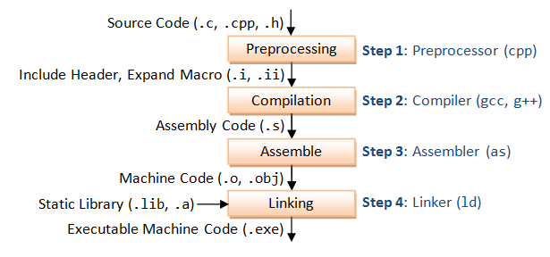

# C Plus Plus language environment configuration

## Source code to Binary code

```cpp
/**
 * @file hello.cpp
 * @author Wei Li (weili_yzzcq@163.com)
 * @brief An introduction to C++, which introduce how to convert source code to binary.
 * @date 2022-04-04
 * 
 * @copyright Copyright (c) 2022
 * 
 * Verbose Mode (-v)
 * You can see the detailed compilation process by enabling -v (verbose) option. For example,
 * g++ -v -o hello.exe hello.cpp
 * 
 * What goes inside the compilation process?
 * Compiler converts a C/C++ program into an executable. 
 * There are four phases for a C program to become an executable: 
 * 1. Pre-processing (hello.cpp ---> hello.ii)
 * 2. Compilation (hello.ii ---> hello.s)
 * 3. Assembly (hello.s ---> hello.o)
 * 4. Linking (hello.s ---> hello)
 * 
 * For example following command line,
 * g++ -Wall -save-temps hello.cpp –o hello
 * 
 * 1. Pre-processing
 * g++ -Wall -E hello.cpp > hello.i
 * g++ -Wall -E hello.cpp -o hello.ii
 * 
 * 2. Compile
 * g++ -Wall -S hello.ii -o hello.s
 * 
 * 3. Assembly
 * g++ -Wall -c hello.s -o hello.o
 * 
 * 4. Linking
 * g++ -Wall hello.o -o hello
 * 
 */

#include <iostream>

int main(int argc, char const *argv[])
{
    std::cout << "Hello World" << std::endl;
    std::cout << "Hello Wei Li" << std::endl;
    return 0;
}
```



```shell
# Verbose Mode (-v)
g++ -v -o hello.exe hello.cpp

# For example following command line,
g++ -Wall -save-temps hello.cpp –o hello

# 1. Pre-processing
g++ -Wall -E hello.cpp -o hello.ii

# 2. Compile
g++ -Wall -S hello.ii -o hello.s
 
# 3. Assembly
g++ -Wall -c hello.s -o hello.o

# 4. Linking
g++ -Wall hello.o -o hello
```


Toolchain is a set of tools needed to translate your source files into an executable file (or a library) and execute it.
Compiler is one of the tools that the toolchain contains. The job of the compiler is to take a source file as an argument, and produce assembly code for the target system - although this view is becoming a bit obsolete: With link time optimisation, compiler instead produces "intermediate representation" language.

A GNU toolchain is a set of tools that uses the GNU compiler i.e. GCC.
So what does the Toolchain containt?
It can depend on context, but following is typical:

**Translation phase**:
- compiler e.g. g++, clang++ cl for MSVC
- assembler
- linker

**Execution phase**:
- dynamic loader
- debugger e.g. gdb
- profiler

**Other tools may also be considered to be part of the tool chain such as**:
- build automation tools e.g. CMake
- standard library
- macro processors
- archivers
- package managers


## Linux Operating System

```shell
# install build-essential
sudo apt update && sudo apt install build-essential

sudo apt install git, cmake, gdb

# vscode 编写源代码 source code
# and then convert the source code to binary.
```

## Windows Operating System

```shell
# download the tool-chain of GCC
# https://winlibs.com/

# configure the system environment variable

# vscode 编写源代码 source code
# and then convert the source code to binary.
```