<!-- 自定义徽章 对应 github 仓库 -->

&emsp;&emsp;
&emsp;&emsp;
&emsp;&emsp;
&emsp;&emsp;

----------------
### [Image Generation via Diffusion Models and Scored-Matching and SDEs](PaperMD/diffusion_models.md)

    <!--  -->
    <!--  -->
    <!--  -->
    

----------------
### [Neural Radiance Fields (NeRF) technique](PaperMD/nerf.md)

  

----------------
### [Graph Neural Networks and Non-Euclidean Convolution](PaperMD/gnn.md)

  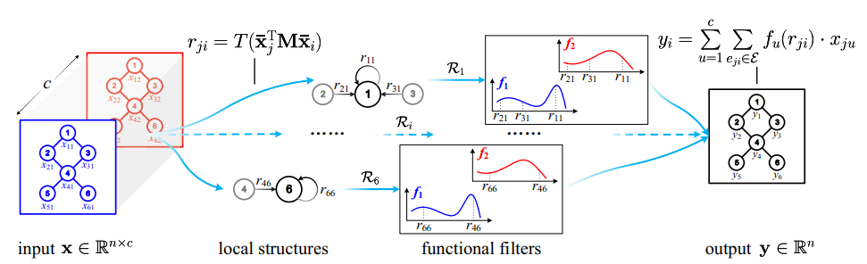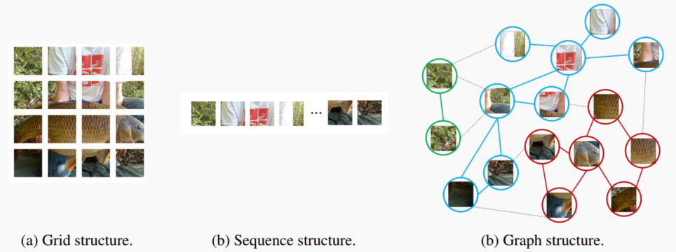

----------------
### [Principles of Parsimony and Self-Consistency for Intelligence](PaperMD/intellience.md)

  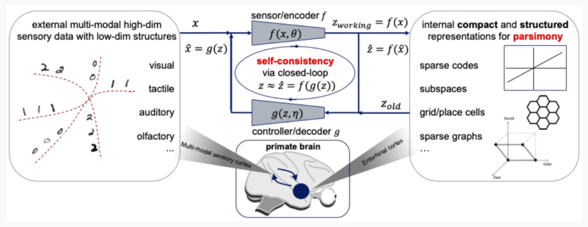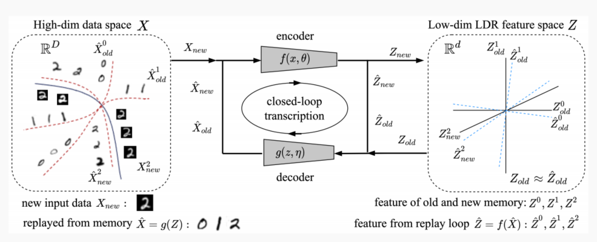

----------------
### [Variational AutoEncoder and Conditional VAE and Flow-based](PaperMD/vae.md)

  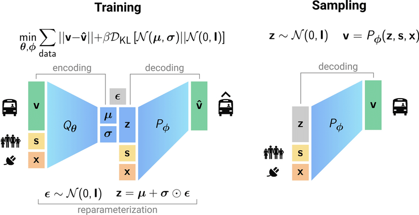

----------------
### [Vision Transformer and Swin Transformer and Masked AutoEncoder](PaperMD/transformer.md)

  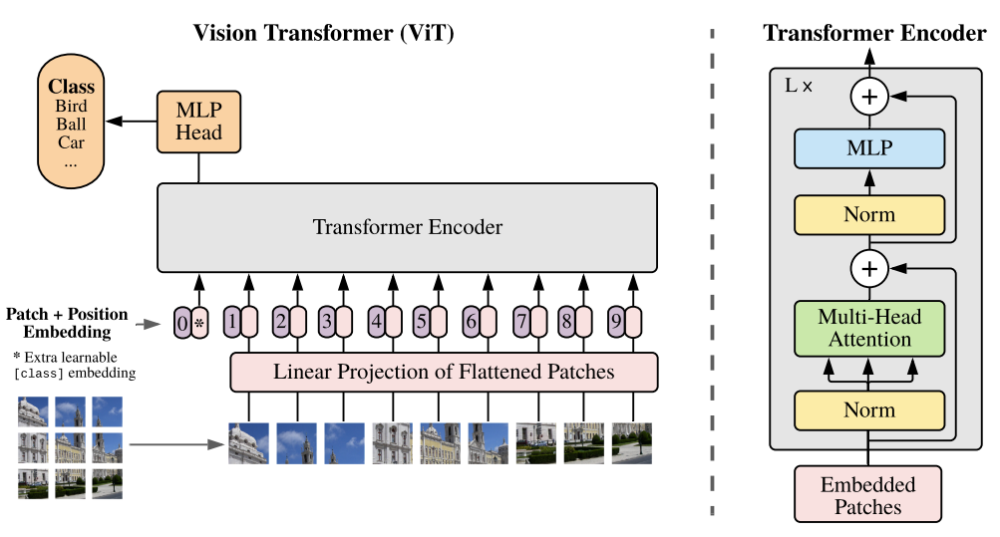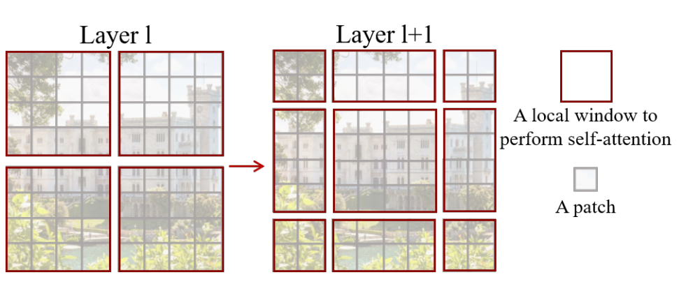

----------------
### [Visual Interpretation of Deep Convolution Neural Networks](PaperMD/visual_interpretation.md)

  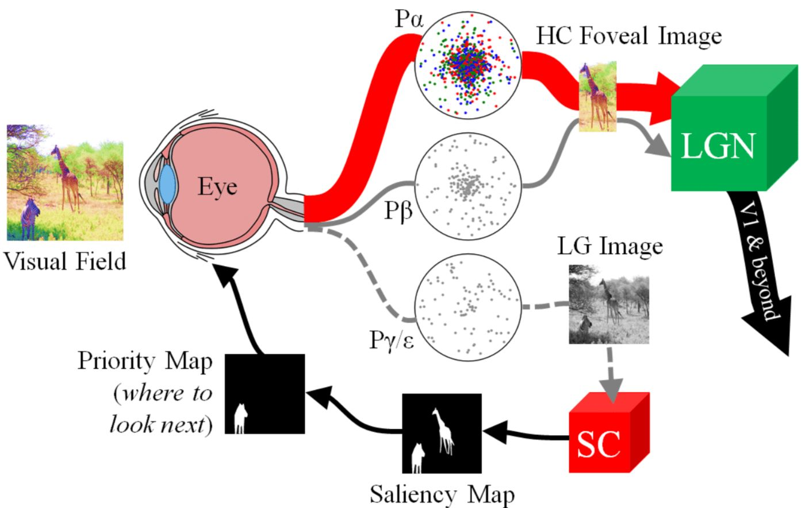

----------------
### [Attention Mechanism in Deep Learning](PaperMD/attention.md)

  

----------------
### [Normalization Methods in Deep Learning](PaperMD/normalization.md)

  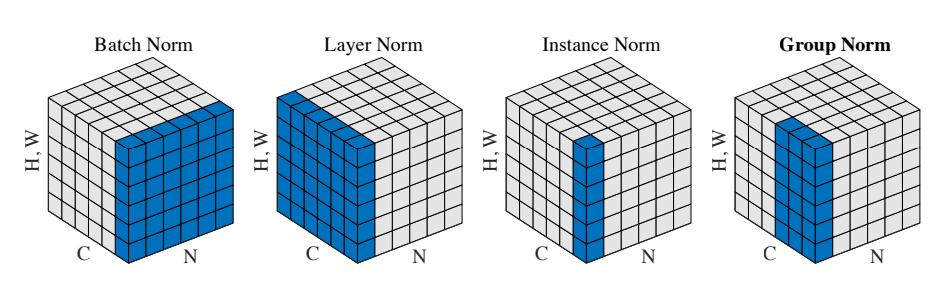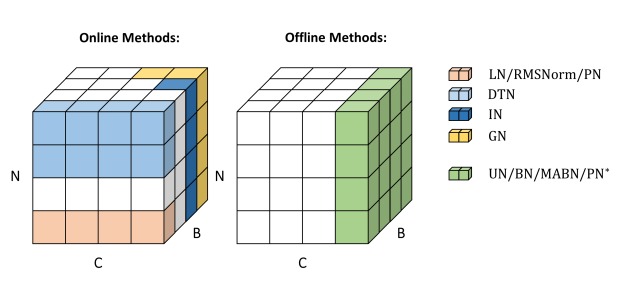

----------------
### [Awesome Understanding of Convolution and Transpose Convolution](PaperMD/awesome_conv.md)

    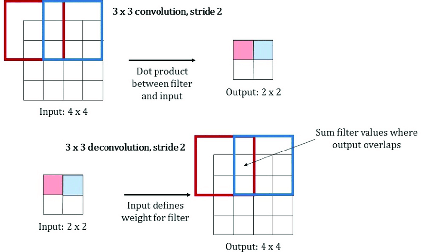

----------------
# Learning TensorFlow2

- [Tensor of TensorFlow](PaperMD/tensor_tensorflow.md)
- [Compute Graph of TensorFlow](PaperMD/compute_graph_tensorflow.md)
- [AutoGrad of TensorFlow](PaperMD/autograd_tensorflow.md)
- [Hierarchy Low-level API of TensorFlow](PaperMD/hierarchy_tensorflow.md)
- [Hierarchy Middel-level API of TensorFlow](PaperMD/hierarchy_middle.md)
- [Hierarchy High-level API of TensorFlow](PaperMD/hierarchy_high.md)
- [Low-level API with Tensor](PaperMD/low_level_API_TF.md)
- [Low-level API with Tensor Operators](PaperMD/tensor_operator_TF.md)
- [Low-level API with Autograph](PaperMD/autograph_TF.md)
- [Middle-level API of tf.data](PaperMD/middle_level_API_TF.md)
- [Middle API with tf.feature_column](PaperMD/middle_API_TF.md)
- [Middle APIs for TensorFlow](PaperMD/middle_APIs_TF.md)
- [High-level API of TensorFlow](PaperMD/high_level_API_TF.md)
- [High APIs to train for TensorFlow](PaperMD/high_train_model_TF.md)
- [Train on GPU for TensorFlow](PaperMD/train_GPU_TF.md)
- [Train on Multi-GPU for TensorFlow](PaperMD/train_GPUs_TF.md)
- [Model Deployment for TensorFlow](PaperMD/model_deploy_TF.md)
- [TensorFlow2 MNIST dataset](PaperMD/mnist_example.md)
- [TensorFlow2 GTSRB dataset](PaperMD/street_sign_example.md)
- [TensorFlow2 CIFAR dataset](PaperMD/cifar_dataset.md)
- [TensorFlow2 Titanic dataset](PaperMD/titanic_dataset.md)
- [TensorFlow2 IMDB dataset](PaperMD/imdb_dataset.md)
- [TensorFlow2 Covid-19 dataset](PaperMD/covid_19.md)

# Learning PyTorch

- [Tensor of PyTorch](PaperMD/tensor_pytorch.md)
- [Compute Graph of PyTorch](PaperMD/compute_graph_pytorch.md)
- [AutoGrad of PyTorch](PaperMD/autograd_pytorch.md)
- [Hierarchy Low-level API of PyTorch](PaperMD/hierarchy_low_level_API_pt.md)
- [Hierarchy Middel-level API of PyTorch](PaperMD/hierarchy_middle_level_API_pt.md)
- [Hierarchy High-level API of PyTorch](PaperMD/hierarchy_high_level_API_pt.md)
- [Low-level API with Tensor](PaperMD/low_level_tensor_pt.md)
- [Low-level API with Tensor Operators](PaperMD/low_level_tensor_operator_pt.md)
- [Low-level API with functional and Module](PaperMD/low_level_functional_pt.md)
- [Middle-level API for data_pipe PyTorch](PaperMD/middle_data_pipe_pt.md)
- [Middle-level API for layers PyTorch](PaperMD/middle_layers_pt.md)
- [Middle-level API for losses PyTorch](PaperMD/middle_losses_pt.md)
- [Middle-level API for TensorBoard PyTorch](PaperMD/middle_tensorboard_pt.md)
- [Build Models for PyTorch](PaperMD/build_model_pytorch.md)
- [Train Models for PyTorch](PaperMD/train_model_pytorch.md)
- [Train Models on GPU for PyTorch](PaperMD/train_gpu_pytorch.md)
- [PyTorch CIFAR dataset](PaperMD/cifar_dataset_pytorch.md)
- [PyTorch Titanic dataset](PaperMD/titanic_dataset_pytorch.md)
- [PyTorch IMDB dataset](PaperMD/imdb_dataset_pytorch.md)
- [PyToch Covid-19 dataset](PaperMD/covid_19_pytorch.md)

# Python & CPlusPlus configure

- [Python 环境配置](PaperMD/python_env_ai.md)
- [TensorFlow2 环境测试](PaperMD/tf_env_test.md)
- [PyTorch 环境测试](PaperMD/pt_env_test.md)
- [C++ 环境配置](PaperMD/cpp_env_test.md)