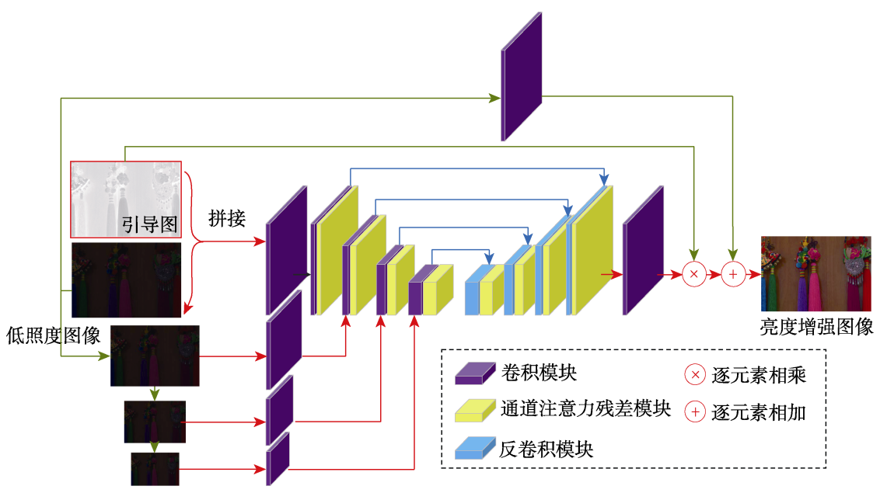

- 👋 Wei Li&nbsp;(黎 为)&nbsp;(Ithaca)
- 🤔 Email: weili_yzzcq@163.com
- ⚡ Blog: [Wei Li Blog](https://2694048168.github.io/blog/)
- 👯 the Internet of Things(IoT) Engineering for Bachelor's degree in SOFTWARE JXUFE
- 😄 the New Generation Electronic Information Technology for Master's degree in SOFTWARE JXUFE
- ⚡ Research in Image Super-Resolution & Low-Light Image Enhancement and Image Restoration
- 💬 Technical points: Deep Learning, PyTorch & TensorFlow2, C++ & Python, Linux & LaTex
- 🌱 Research area: **Image Processing & Image Restoration**, **Computer Vision & Neural Networks**, **3D Vision & Neural Rendering**,   &emsp;&emsp;&emsp;**Machine Vision & The Industrial Internet of Things**

### My skills

  
  
  
  
  
  
  
  
  
  
  
  

<!-- https://github.com/anuraghazra/github-readme-stats -->

<!-- https://github.com/DenverCoder1/github-readme-streak-stats -->

 
<!-- https://github.com/Ashutosh00710/github-readme-activity-graph -->

 

<!--  -->

<!-- 自定义徽章 对应 github 仓库 -->
<!-- 

 -->

<!-- paper and project -->

<blockquote>

### 基于照度图引导的低照度图像增强网络
- 黄淑英&nbsp;,&nbsp;[é»ä¸ºâœ](https://2694048168.github.io/blog/)&nbsp;,&nbsp;杨勇&nbsp;,&nbsp;万伟国&nbsp;,&nbsp;赖厚增
- Published on 计算机辅助设计与图形学学报(CAD&CG) in 2022
- [Paper Link](https://www.jcad.cn/cn/article/doi/10.3724/SP.J.1089.2024.19779)
</blockquote>

 

<!-- paper and project -->

<blockquote>

### LSRN-AED: lightweight super-resolution network based on asymmetric encoder–decoder
- Shuying Huang&nbsp;,&nbsp;[Wei Li✝](https://2694048168.github.io/blog/)&nbsp;,&nbsp;Yong Yang&nbsp;,&nbsp;Weiguo Wan&nbsp;,&nbsp;Houzeng Lai
- Published on Soft Computing(SOFT COMPUT) in 2024
- [Paper Link](https://link.springer.com/article/10.1007/s00500-024-09745-5)
</blockquote>

 

<!-- paper and project -->

<blockquote>

### TFEN: two-stage feature enhancement network for single-image super-resolution
- Shuying Huang&nbsp;,&nbsp;Houzeng Lai&nbsp;,&nbsp;Yong Yang&nbsp;,&nbsp;Weiguo Wan&nbsp;,&nbsp;[Wei Li✝](https://2694048168.github.io/blog/)
- Published on International Journal of Machine Learning and Cybernetics(JMLC) in 2023
- [Paper Link](https://link.springer.com/article/10.1007/s13042-023-01928-0)
</blockquote>

 

<!-- paper and project -->

<blockquote>

### Diffusion: Image Generation via Diffusion Models and Scored-Matching and SDEs
<!-- 
 -->
[Wei Li*✝](https://2694048168.github.io/blog/)&nbsp;|&nbsp;[Project Link](PaperMD/diffusion_models.md)
<!-- * 一般表示通信作者,  ✝ 一般表示相同的贡献, 然后作者排名按照贡献降序排列(第一作者)-->
</blockquote>

 

<!--  -->

<blockquote>

### GNNs: Graph Neural Networks and Non-Euclidean Convolution
[Wei Li*✝](https://2694048168.github.io/blog/)&nbsp;|&nbsp;[Project Link](PaperMD/gnn.md)
</blockquote>

 

<!--  -->

<blockquote>

### Transformer: Vision Transformer and Swin Transformer and Masked AutoEncoder
[Wei Li*✝](https://2694048168.github.io/blog/)&nbsp;|&nbsp;[Project Link](PaperMD/transformer.md)
</blockquote>

 

<!--  -->

<blockquote>

### Image SR: Image Super-Resolution and Image Restoration
[Wei Li*✝](https://2694048168.github.io/blog/)&nbsp;|&nbsp;[Project Link](PaperMD/image_super_resolution.md)
</blockquote>

 

<!--  -->

<blockquote>

### CNNs: Awesome Understanding of Convolution and Transpose Convolution
[Wei Li*✝](https://2694048168.github.io/blog/)&nbsp;|&nbsp;[Project Link](PaperMD/awesome_conv.md)
</blockquote>

 

<!--  -->

<blockquote>

### PyTorch: the tutorial of Learning PyTorch
[Wei Li*✝](https://2694048168.github.io/blog/)&nbsp;|&nbsp;[Project Link](PaperMD/learning_pytorch.md)&nbsp;|&nbsp;[Annotation Code](https://github.com/2694048168/ComputerVisionDeepLearning/tree/main/Learning_PyTorch)
</blockquote>

 

<!--  -->

<blockquote>

### TensorFlow2: the tutorial of Learning TensorFlow
[Wei Li*✝](https://2694048168.github.io/blog/)&nbsp;|&nbsp;[Project Link](PaperMD/learning_tensorflow.md)&nbsp;|&nbsp;[Annotation Code](https://github.com/2694048168/ComputerVisionDeepLearning/tree/main/Learning_TensorFlow2)
</blockquote>

 

<!--  -->

<!-- the article of notes -->
----------------
### Artificial Intelligence and Computer Vision
- [Image Super-Resolution and Image Restoration](PaperMD/image_super_resolution.md)
- [Image Generation via Diffusion Models and Scored-Matching and SDEs](PaperMD/diffusion_models.md)
- [Graph Neural Networks and Non-Euclidean Convolution](PaperMD/gnn.md)
- [Principles of Parsimony and Self-Consistency for Intelligence](PaperMD/intellience.md)
- [Vision Transformer and Swin Transformer and Masked AutoEncoder](PaperMD/transformer.md)
- [Attention Mechanism in Deep Learning](PaperMD/attention.md)
- [YOLO algorithm for Object Detecture](PaperMD/YOLO_algorithm.md)
- [Normalization Methods in Deep Learning](PaperMD/normalization.md)
- [Visual Interpretation of Deep Convolution Neural Networks](PaperMD/visual_interpretation.md)
- [Awesome Understanding of Convolution and Transpose Convolution](PaperMD/awesome_conv.md)
- [Image Quality Assessment, IQA](PaperMD/image_quality_assessment.md)
- [Deep Generative Learning: Variational AutoEncoder and and Flow-based and GANs](PaperMD/vae.md)
- [3D Reconstruction: Neural Radiance Fields (NeRF) technique](PaperMD/nerf.md)

### CPlusPlus & Python
- [Visual Studio项目属性配置](PaperMD/project_config.md)
- [模式框架: 三层架构、MVC、MVVM](PaperMD/framework.md)
- [vcpkg and find_package](PaperMD/vcpkg.md)
- [Modern CMake](PaperMD/ModernCMake.md)
- [CMake Examples](https://github.com/2694048168/C-and-C-plus-plus/blob/master/CMakeReadme.md)
- [C++ Configuration](PaperMD/cpp_env_test.md)
- [WSL2 on Windows11](PaperMD/wsl_install.md)
- [Python Configuration](PaperMD/python_env_ai.md)
- [TensorFlow2 环境测试](PaperMD/tf_env_test.md)
- [PyTorch 环境测试](PaperMD/pt_env_test.md)
