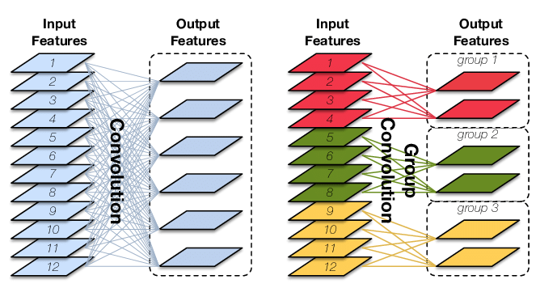

<!-- 自定义徽章 对应 github 仓库 -->

&emsp;&emsp;
&emsp;&emsp;
&emsp;&emsp;
&emsp;&emsp;

> Wei Li&nbsp;(黎 为)  Email: weili_yzzcq@163.com  the Internet of Things(IoT) Engineering for Bachelor's degree (物联网工程) in SOFTWARE JXUFE;  the New Generation Electronic Information Technology for Master's degree (新一代电子信息技术) and Research in Image Super-Resolution & Low-Light Image Enhancement and Image Restoration (图像超分辨率和图像复原) in SOFTWARE JXUFE;  the Technical points of interest: Artificial Intelligence(AI), Deep Learning(DL), PyTorch and TensorFlow2, CPlusPlus and Python, Linux and shell and LaTex;  the main research area: **Image Processing & Image Restoration**, **Computer Vision & Neural Networks**, **3D Vision & Neural Rendering**.

<!-- paper and project -->

<blockquote>

### Diffusion: Image Generation via Diffusion Models and Scored-Matching and SDEs
<!-- 
 -->
[Wei Li*✝](https://2694048168.github.io/blog/)&nbsp;|&nbsp;[Project Link](PaperMD/diffusion_models.md)
<!-- * 一般表示通信作者,  ✝ 一般表示相同的贡献, 然后作者排名按照贡献降序排列(第一作者)-->
</blockquote>

 

<!--  -->

<blockquote>

### GNNs: Graph Neural Networks and Non-Euclidean Convolution
[Wei Li*✝](https://2694048168.github.io/blog/)&nbsp;|&nbsp;[Project Link](PaperMD/gnn.md)
</blockquote>

 

<!--  -->

<blockquote>

### Transformer: Vision Transformer and Swin Transformer and Masked AutoEncoder
[Wei Li*✝](https://2694048168.github.io/blog/)&nbsp;|&nbsp;[Project Link](PaperMD/transformer.md)
</blockquote>

 

<!--  -->

<blockquote>

### Image SR: Image Super-Resolution and Image Restoration
[Wei Li*✝](https://2694048168.github.io/blog/)&nbsp;|&nbsp;[Project Link](PaperMD/image_super_resolution.md)
</blockquote>

 

<!--  -->

<blockquote>

### CNNs: Awesome Understanding of Convolution and Transpose Convolution
[Wei Li*✝](https://2694048168.github.io/blog/)&nbsp;|&nbsp;[Project Link](PaperMD/awesome_conv.md)
</blockquote>

 

<!--  -->

<blockquote>

### PyTorch: the tutorial of Learning PyTorch
[Wei Li*✝](https://2694048168.github.io/blog/)&nbsp;|&nbsp;[Project Link](PaperMD/learning_pytorch.md)&nbsp;|&nbsp;[Annotation Code](https://github.com/2694048168/ComputerVisionDeepLearning/tree/main/Learning_PyTorch)
</blockquote>

 

<!--  -->

<blockquote>

### TensorFlow2: the tutorial of Learning TensorFlow
[Wei Li*✝](https://2694048168.github.io/blog/)&nbsp;|&nbsp;[Project Link](PaperMD/learning_tensorflow.md)&nbsp;|&nbsp;[Annotation Code](https://github.com/2694048168/ComputerVisionDeepLearning/tree/main/Learning_TensorFlow2)
</blockquote>

 

<!-- the article of notes -->
----------------
# Artificial Intelligence and Computer Vision
- [Image Super-Resolution and Image Restoration](PaperMD/image_super_resolution.md)
- [Image Generation via Diffusion Models and Scored-Matching and SDEs](PaperMD/diffusion_models.md)
- [Graph Neural Networks and Non-Euclidean Convolution](PaperMD/gnn.md)
- [Principles of Parsimony and Self-Consistency for Intelligence](PaperMD/intellience.md)
- [Vision Transformer and Swin Transformer and Masked AutoEncoder](PaperMD/transformer.md)
- [Attention Mechanism in Deep Learning](PaperMD/attention.md)
- [YOLO algorithm for Object Detecture](PaperMD/YOLO_algorithm.md)
- [Normalization Methods in Deep Learning](PaperMD/normalization.md)
- [Visual Interpretation of Deep Convolution Neural Networks](PaperMD/visual_interpretation.md)
- [Awesome Understanding of Convolution and Transpose Convolution](PaperMD/awesome_conv.md)
- [Image Quality Assessment, IQA](PaperMD/image_quality_assessment.md)
- [Deep Generative Learning: Variational AutoEncoder and and Flow-based and GANs](PaperMD/vae.md)
- [3D Reconstruction: Neural Radiance Fields (NeRF) technique](PaperMD/nerf.md)

# Python & CPlusPlus configure
- [Python 环境配置](PaperMD/python_env_ai.md)
- [TensorFlow2 环境测试](PaperMD/tf_env_test.md)
- [PyTorch 环境测试](PaperMD/pt_env_test.md)
- [C++ 环境配置](PaperMD/cpp_env_test.md)
